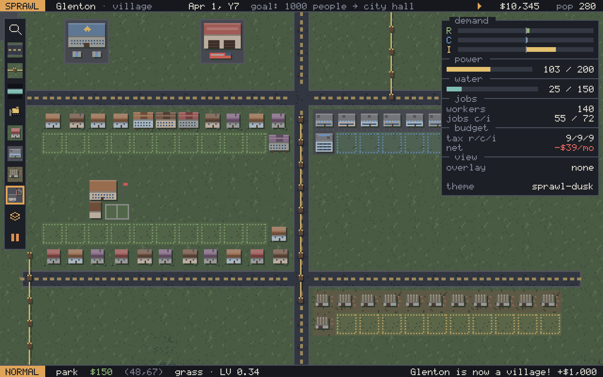

# Sprawl

A small, keyboard-first, pixel-art city builder for Linux, made to feel at
home on Omarchy (Arch + Hyprland). Roads, zones, power, water, services and
a budget — no traffic, disasters or individual citizens. It follows your
Omarchy theme, live.



## Install

Needs Go 1.27+ and the usual X11/GL and ALSA libraries (present on any
Omarchy desktop):

```sh
sudo pacman -S --needed go mesa libxrandr libxcursor libxinerama libxi
git clone https://github.com/antoniowav/sprawl && cd sprawl
dist/install.sh            # builds, then adds Sprawl to your app launcher
```

`dist/install.sh` puts the binary in `~/.local/bin`, the icon in
`~/.local/share/icons` and a launcher entry in
`~/.local/share/applications`. `dist/install.sh --uninstall` removes them
(saves and config stay). To just run it from the source tree:
`go build -o sprawl ./cmd/sprawl && ./sprawl`.

Distributions: `make && make install PREFIX=/usr DESTDIR=...` installs the
binary, icons (32–512 px), desktop entry, AppStream metadata, man page and
third-party licence notices. An AUR package stub lives in `dist/PKGBUILD`, with a desktop entry in
`dist/sprawl.desktop` (window class `sprawl`, for Hyprland rules).

## Playing

Lay roads, zone next to them, connect power, and the city grows. Lots only
develop when they touch a road. Medium and high density need water, and high
density needs good land value: services, clean air, or a waterfront. Power
travels along roads, power lines, zones and buildings, so a block touching a
road that leads to a plant has power; use lines to reach the rest.

### Keys

| Key | Action |
|---|---|
| `h j k l` / arrows | move cursor |
| `H J K L` / Shift+arrows | move 8 tiles |
| `c` | centre camera on cursor |
| `+` `-` / scroll | zoom (1×–4×, always crisp) |
| right or middle drag | pan |
| `r` `p` `w` `d` | road, power line, water pipe, bulldoze |
| `z` then `r` `c` `i` | residential, commercial, industrial zone |
| `b` | buildings: power plant, water pump, police, fire, school |
| `Enter` | apply the tool at the cursor |
| `v` … `Enter` | visual mode: rectangle (zones, bulldoze) or L-path (roads, lines, pipes); `o` swaps the corner |
| `Shift+Enter` | paint mode: every move applies the tool |
| left click / drag | apply the tool / select like visual mode |
| `o` | cycle overlays: power, water, police, fire, school, land value, pollution |
| `u` | underground view (pipes); in it, bulldoze removes pipes |
| `Space`, `1` `2` `3` | pause, speed |
| `Tab` | side panel |
| `e` / `F2` | event log |
| `Ctrl+S`, `Ctrl+Shift+S` | save, save as |
| `Ctrl+O`, `Ctrl+N`, `Ctrl+Q` | open a save, new city, quit (asks if unsaved) |
| `Ctrl+Z`, `Ctrl+Shift+Z` / `Ctrl+Y` | undo, redo (money included) |
| `Ctrl+B`, `Ctrl+G` | budget, statistics charts |
| `F1` | getting-started guide |
| `Esc` with nothing selected | menu: save, open, settings, quit to title |
| `:` | command palette (Tab completes, ↑↓ history) |
| `?` | key overlay (generated from your keymap) |
| `Esc` | back out: visual → paint → tool |

### Commands

| Command | |
|---|---|
| `:budget` | income and upkeep breakdown |
| `:tax 12`, `:tax r 7` | set all taxes, or one zone's (0–20, 9 is neutral) |
| `:loan`, `:repay` | borrow $10,000 (repaid $450/month for 24 months), or pay off early |
| `:w [name]`, `:e [name]` | save, load (`:e` alone lists saves) |
| `:new [seed]`, `:name <city>` | new map, rename |
| `:theme reload` | re-read the Omarchy theme |
| `:q`, `:wq` | quit, save and quit |

Twelve months in debt and the city goes bankrupt.

### Buildings and goals

Power plant (smoky, 200 power), wind turbine (clean, 25), water pump (by
water, 150), water tower (anywhere, 40), police, fire station, school,
park. Population milestones pay a grant and promote the settlement from
hamlet to metropolis; the city hall unlocks at 1,000 people (+5 % taxes)
and the stadium at 2,500 (people want to live near it). The next goal is
always in the top bar.

## Files

- Config: `~/.config/sprawl/config.toml`, written with comments on first
  run. Every key is rebindable under `[keys]`, e.g. `road = ["R"]`.
- Saves: `~/.local/share/sprawl/*.city` (gzip'd JSON), autosave every 6
  game months.
- Theme: read from Cuore (`~/.local/state/cuore/current/theme`) or Omarchy
  (`~/.config/omarchy/current/theme`, `~/.local/state/omarchy/current/theme`):
  `colors.toml`, falling back to `alacritty.toml`. `SPRAWL_THEME_DIR`
  overrides. Without either it uses a built-in palette.

## Flags

`-seed N` map seed · `-config path` · `-version` ·
`-screenshot out.png` (render a 1280×800 frame and exit) with
`-actions "r,v,L,apply,:tax 10"` and `-ticks N` to script it.

## Dependencies

Ebitengine (graphics, input), oto (sound; Ebitengine's audio library) and
BurntSushi/toml (config and theme files). Everything else, including the
font, sprites and sound effects, is generated by Sprawl's own code. Licence
texts of everything linked into the binary are in
`dist/THIRD_PARTY_LICENSES.txt` (`make licenses` regenerates it).

## Development

`make check` runs tests, gofmt and vet. `SPRAWL_CPUPROFILE=cpu.prof` writes
a 15-second CPU profile. Design and formulas are in
`SPEC.md`; milestones in `PLAN.md`. `BALANCE=1 go test ./sim -run Balance -v`
prints a growth curve.

## Licence

MIT, see `LICENSE`. Third-party notices: `dist/THIRD_PARTY_LICENSES.txt`.
